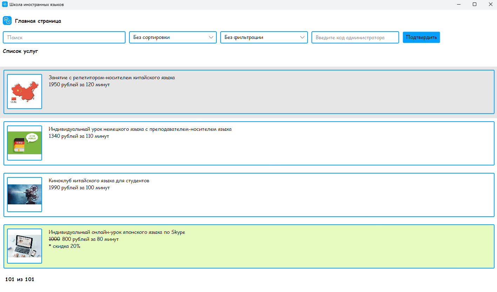
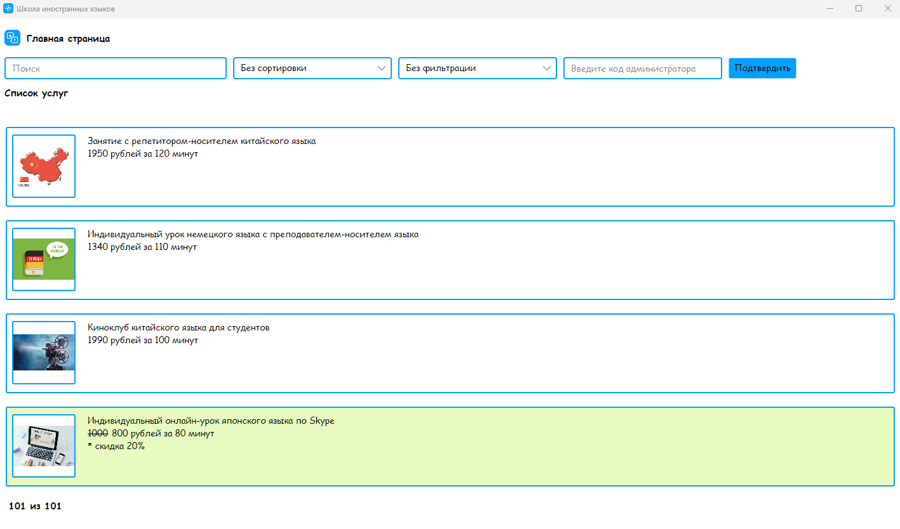
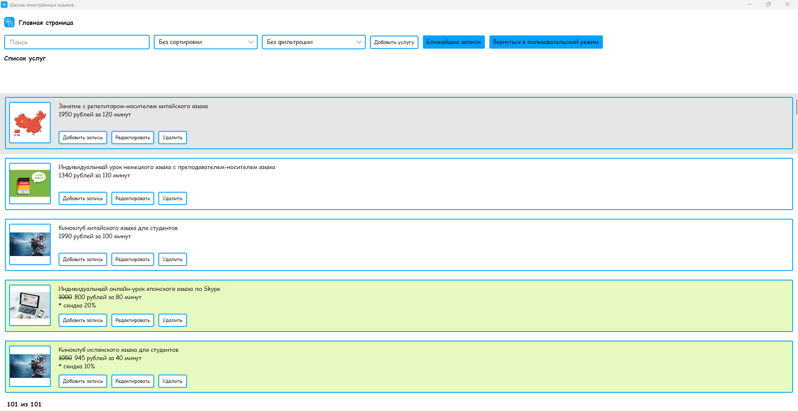
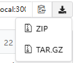

<h1 class="fig">Школа для иностранных языков</h1>

## Описание

Данный проект реализовывает десктопное приложение предназначенное для обеспечения удобного доступа к списку, предоставляемых школой иностранных  языков. Приложение предоставляет функции поиска, сортировки и фильтрации, что позволяет пользователю легко находить необходимые услуги. Приложение имеет два режима работы:  администратора и пользователя.

## О проекте

### Основные функции

- **Список услуг**: Пользователи могут просматривать полный список услуг, предлагаемых школой, включая информацию о названии услуги, описании услуги, ценах, скидках и длительности услуги.

- **Поиск**: Втроенный механизм поиска позволяет быстро находить нужные услуги по их названию или описанию.

- **Сортировка и фильтрация**: Возможность сортировки услуг по различным параметрам(по возрастанию/убыванию стоимости) и фильтрации по рамеру скидки.

### Режимы использования

1. **Пользовательский режим**:
    - Доступен просмотр списка услуг.
    - Доступен функционал поиска, сортировки и фильтрации.
    - Доступ к вводу кода администратора, если пользователь им является и знает правильный код.

2. **Пользовательский режим**:
    - Доступен просмотр списка услуг.
    - Доступен функционал поиска, сортировки и фильтрации.
    - Возможность возврата в пользовательский режим.
    - Возможность добавления, редактирования и удаления услуги из списка.
    - Возможность создание записей на услуги, что позволяет администратору управлять расписанием и загруженностью услуг.
    - Доступен просмотр ближайших записей (на текущий день и следующий), что упрощает планирование и организацию процессов в школе.

# Режимы работы

## Режим пользователя

## **Режим администратора**

# Технологии и инструменты разработки

Приложение было создано с использованием следующих технологий и инструментов:

- **Язык программирования**: C#
- **IDE**: Visual Studio
- **Framework**: Avalonia UI
- **UI-библиотека**: ReactiveUI
- **Архитектурный шаблон**: MVVM (Model-View-ViewModel)
- **ORM для работы с базой данных**: Entity Framework Core 
- **База данных**: PostgreSQL 
- **Язык разметки**: XAML 
- **Менеджер пакетов для .NET**: NuGet 

# Особенности проекта

### **Особенности**:
- **Поиск** - возможность быстрых поисков по базе данных, позволяющая находить услуги по их наименованию или описанию.

- **Сортировка** - механизм, позволяющий пользователям упорядочивать услуги по стоимости, а именно либо по убыванию, либо по возрастанию.

- **Фильтрация** - инструмент для настройки отображения услуг по определённому параметру, например, услуги со скидкой от 15% до 30%.

- **Режимы работы** - две основные роли: администратор, который управляет услугами и записями на них, и пользователь, который ищет нужные ему услуги.

Пример кода с методом реализацией одновременного поиска, фильтрации и сортировки:

    public void filtersService()
    {
        ServicesList = MainWindowViewModel.myConnection.Services.Include(x => x.ClientServices).ToList();

        if (!string.IsNullOrEmpty(_search))
        {
            ServicesList = ServicesList.Where(x => x.Title.ToLower().Contains(_search.ToLower()) ||
            x.Description.ToLower().Contains(_search.ToLower())).ToList();                
            CountItemsList = ServicesList.Count;
        }            

        float dis1 = 0.05F;
        float dis2 = 0.15F;
        float dis3 = 0.3F;
        float dis4 = 0.7F;

        switch (_selectedSort)
        {
            case 0:
                ServicesList = ServicesList.ToList();
                CountItemsList = ServicesList.Count;
                break;
            case 1:
                ServicesList = ServicesList.OrderBy(x => x.Cost).ToList();
                CountItemsList = ServicesList.Count;
                break;
            case 2:
                ServicesList = ServicesList.OrderByDescending(x => x.Cost).ToList();
                CountItemsList = ServicesList.Count;
                break;                
        }

        switch (_selectedFilter)
        {
            case 0:
                ServicesList = ServicesList.ToList();
                CountItemsList = ServicesList.Count;
                break;
            case 1:
                ServicesList = ServicesList.Where(x => x.Discount < dis1).ToList();
                CountItemsList = ServicesList.Count;
                break;
            case 2:
                ServicesList = ServicesList.Where(x => x.Discount >= dis1 && x.Discount < dis2).ToList();
                CountItemsList = ServicesList.Count;
                break;
            case 3:
                ServicesList = ServicesList.Where(x => x.Discount >= dis2 && x.Discount < dis3).ToList();
                CountItemsList = ServicesList.Count;
                break;
            case 4:
                ServicesList = ServicesList.Where(x => x.Discount >= dis3 && x.Discount < dis4).ToList();
                CountItemsList = ServicesList.Count;
                break;
            case 5:
                ServicesList = ServicesList.Where(x => x.Discount >= dis4).ToList();
                CountItemsList = ServicesList.Count;
                break;
        }

        if (CountItemsList == 0) NoResults = true;
        else NoResults = false;
    }

# Начало работы

Чтобы начать работать с проектом, размещённым на Gogs, следуйте этим шагам и условиям:

## Необходимые условия

Перед запуском приложения убедитесь, что ваш локальный компьютер соответствует следующим требованиям:

1. Операционная система

   - Windows 10 или выше
   - macOS 10.14 (Mojave) или выше
   - Linux (с поддержкой необходимых библиотек)

2. Процессор

   - Минимум: 2 ядра
   - Рекомендуется: 4 ядра или больше для оптимальной работы

3. Оперативная память

   - Минимум: 4 ГБ
   - Рекомендуется: 8 ГБ или больше, особенно для ресурсовёмких приложений

4. Место на диске

   - Минимум: 1 ГБ свободного места для установки приложения и зависимостей
   - Рекомендуется: 5 ГБ и более для хранения всех необходимых компонентов и данных
5. Программа-архиватор для распоковки архиватора (на выбор)
    - WinRAR
    - 7-Zip
6. Доступ к интернету для загрузки информации из базы данных

## Установка

- **Откройте** один из браузеров: _Chrome_,_Opera_,_MicrosoftEdge_
- **Перейдите** на сайт по ссылке: http://gogs.ngknn.ru:3000/GoncharovaNE33P/Foreign_Language_School.git

- **Скачайте** архивный файл (ZIP):

- **Разархивируйте** скаченный файл, запустите приложение, найдя и открыв файл **ServicesAndClients.exe** в папке **net8.0** в архиве bin по следующему пути: _ServicesAndClients > bin > Debug > net8.0_

## Авторы
- **Гончарова Надежда** - главный разработчик - [Профиль с другими проектами](http://gogs.ngknn.ru:3000/GoncharovaNE33P) 
